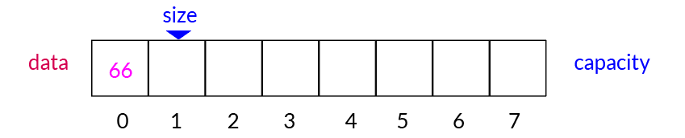

# 1.1 Array
## 1 使用Java中的数组 
- 数组是一种数据结构，Java中的数组只能用来存储相同类型的数据。
- 可以通过索引进行任意访问（random access）——数组的最大优点。
- 创建数组开辟空间时必须声明可以存储多少元素——数组的局限性（静态数组），数据容量capacity固定，创建后无法改变。

```java
public class Main {
    public static void main(String[] args) {
        int[] arr = new int[10];

        // 可以使用for循环对数组进行赋值
        for(int i = 1; i < arr.length; i++)
            arr[i] = i;

        // 也可以在声明数组同时对数组进行赋值
        int[] scores = new int[]{100,99,78};

        // 打印输出用for循环或for-each，这是数组的可遍历/迭代特性。
        for(int i = 0; i < scores.length; i++)
            System.out.println(scores[i]);

        for(int score:scores)
            System.out.println(score);
        
        // 使用索引，修改数组元素
        scores[0] = 96;
        for(int i = 0; i < scores.length; i++)
            System.out.println(scores[i]);
    }
}
```
## 2 二次封装属于我们的数组
- 数组的索引可以有语义，也可以没有语义，最好是有语义，但并非所有有语义的索引都适用于数组（例如身份证号码）。

    - capacity为数组容量
    - size为数组中元素实际数量，初始时数组为空，size = 0,size也即数组最后一个元素后面一个位置的索引
```java
public class Array{}
```
- 成员变量
```java
public class Array{
    // 成员变量
    private int[] data;
    private int size;
    // 构造函数，传入数组的容量capacity构造Array
    public Array(int capacity) {
        data = new int[capacity];
        size = 0;
    }
    // 无参数的构造函数，默认数组的容量capacity = 10
    public Array(){
        this(10);
    }
    // 获取数组中的元素个数
    public int getSize() {
        return size;
    }
    // 获取数组的容量
    public int getCapacity(){
        return data.length;
    }
    // 返回数组是否为空
    public boolean isEmpty() {
        return size == 0;
    }
}
```
## 3 向数组中添加元素
### 3.1 向数组末尾添加元素

- 由于数组空间固定，在添加元素时需先考察是否有剩余空间
- 由于size等于数组最后一个元素的下一个元素的索引，在数组末尾添加元素即data[size] = e(待添加元素）
- 添加元素后要维护size，进行size++
```java
// 向数组末尾添加新元素e
public void addLast(int e)
{
    // 添加元素时需考察数组容量是否已满
    if(size == data.length)
        throw new IllegalArgumentException("AddLast failed. Array is full.");
    data[size] = e;
    size++;
}
```
### 3.2 向指定位置index添加元素e

- 先考察是否有剩余空间
- 从最后一个元素(data[size-1])开始往前到index这个位置的元素，每一个元素向后移动一个位置（赋值）
```java
// 在第index个位置插入一个新元素e
public void add(int index, int e)
{
    // 添加元素时需考察数组容量是否已满
    if(size == data.length)
        throw new IllegalArgumentException("Add failed. Array is full.");
    // 考察index是否合法
    if(index < 0 || index > size)
        throw new IllegalArgumentException("Add failed. Required index >= 0 and index <= size.");
    // 从最后一个元素data[i]到插入的index个位置的元素依次向后移动一个位置
    for(int i = size - 1; i >= index; i--)
        data[i + 1] = data[i];
    // 移出位置后，将元素e放到索引为index处
    data[index] = e;
    size++; // 维护size
}
// 向所有元素前添加一个新元素，即在索引为0的位置添加元素e。
public void addFirst(int e)
{
    add(0, e);
}
// 向数组末尾添加元素，利用add()方法，即在索引为size的位置添加元素e。
public void addLast(int e)
{
    add(size, e);
}
```
## 4 数组中查询元素和修改元素
- 先定义我们自己的打印输出样式，Override父类Object的toString()方法，用来描述我们的数组。
```java
@Override
public String toString()
{
    StringBuilder result= new StringBuilder();
    result.append(String.format("Array: size = %d, capacity = %d\n", size, data.length));
    result.append('[');
    for(int i = 0; i < size; i++)
    {
        result.append(data[i]);
        if(i != size - 1) // 判断i是否为最后一个元素
            result.append(", ");
    }
    result.append(']');
    return result.toString();
}
```
```java
// 获取index索引位置的元素
public int get(int index)
{
    // 考察index是否合法
    if(index < 0 || index > size)
        throw new IllegalArgumentException("Get failed. Index is illegal.");

    return data[index];
}

// 修改index索引位置的元素为e
public void set(int index, int e)
{
    if(index < 0 || index > size)
        throw new IllegalArgumentException("Set failed. Require index >= 0 and index < size.");
    data[index] = e;
}
```
## 5 数组中的包含，搜索和删除元素
### 5.1 查找数组中是否包含元素e
```java
// 查找数组中是否有元素e
public boolean contains(int e)
{
    for(int i = 0; i < size; i++) // 遍历数组
    {
        if(data[i] == e)
            return true;
    }
    return false;
}
```
### 5.2 查找数组中元素e所在的索引
```java
// 查找数组中元素e所在的索引，如果不存在元素e,则返回-1（只能找到匹配的第一个元素e)
public int find(int e)
{
    for(int i = 0; i < size; i++)
    {
        if(data[i] == e)
            return i;
    }
    return -1;
}
```
### 5.3 从数组中删除元素指定位置index的元素e
- 与添加操作相反，即将删除索引位置后的元素依次向前移动一个位置。

- 先保存index位置的元素，最后要返回该元素
- 从index+1位置元素开始到size-1的每个元素向前赋值
```java
// 从数组中删除index位置的元素，返回删除的元素
public int remove(int index)
{
    if(index < 0 || index > size)
        throw new IllegalArgumentException("Remove failed. Index is illegal.");

    int ret = data[index];// 待返回值return
    for(int i = index + 1; i < size; i++) 
        data[i-1] = data[i];
    size--;
    return ret;
}
//从数组中删除第一个元素，返回删除的元素
public int removeFirst()
{
    return remove(0);
}
//从数组中删除最后一个元素，返回删除的元素
public int removeLast()
{
    return remove(size - 1);
}
```
- <strong>删除指定元素</strong>
  - 先进行查找操作，`find(e)`，可得到该元素是否存在，存在返回索引index，如果返回值不为-1，即该元素存在，则进行`remove(index)`操作。
```java
// 从数组中删除元素e（只能删除匹配的第一个元素e)
public void removeElement(int e)
{
    // 先在数组中查找元素e,存在则返回e的索引位置
    int index = find(e);
    // 找到元素后，用remove()方法进行删除
    if(index != -1)
        remove(index);
}
```
## 6 使用泛型
- 容器应装入任意类型的数据，包括Java内置数据类型和用户自定义类型
- 注意不可以是基本数据类型，只能是类对象，基本数据类型使用对应的包装类
```java
public class Array<E> {
    // 成员变量
    private E[] data;
    private int size;

    // 构造函数，传入数组的容量capacity构造Array
    public Array(int capacity) {
        //Java不支持new一个泛型数组
        data = (E[])new Object[capacity];
        size = 0;
    }

    public Array(){
        this(10);
    }

    //向数组末尾添加元素e
    public void addLast (E e) {
        //先查看数组是否有剩余容量
        add(size, e);
    }

    // 向数组开头添加元素e
    public void addFirst(E e) {
        add(0,e);
    }

    // 向数组索引为index的位置插入元素e
    public void add(int index, E e) {
        if (size == data.length)
            throw new IllegalArgumentException("Add failed. Array is full.");
        if (index < 0 || index > size)
            throw new IllegalArgumentException("Add failed. Require index >= 0 and index <= size");

        for (int i = size - 1; i >= index; i--)
            data[i + 1] = data[i];
        data[index] = e;
        size ++;
    }

    // 获取index索引位置的元素
    public E get(int index) {
        if (index < 0 || index >= size)
            throw new IllegalArgumentException("Get failed. Require index >= 0 and index < size");
        return data[index];
    }

    // 修改index索引位置的元素为e
    public void set(int index, E e) {
        if (index < 0 || index >= size)
            throw new IllegalArgumentException("Set failed. Require index >= 0 and index < size");
        data[index] = e;
    }

    // 查找数组中是否有元素e
    public boolean contains(E e) {
        for(int i = 0; i < size; i++){
            if (data[i] == e)
                return true;
        }
        return false;
    }

    // 查找数组中元素e所在的索引，如果不存在元素e, 则返回-1
    public int find(E e) {
        for(int i = 0; i < size; i++) {
            if (data[i] == e)
                return i;
        }
        return -1;
    }

    // 从数组中删除index位置的元素，返回删除的元素
    public E remove(int index) {
        if(index < 0 || index >= size)
            throw new IllegalArgumentException("Remove failed. Index is illegal.");
        E ret =  data[index];

        for(int i = index +1; i<size; i++)
            data[i-1] = data[i];
        size--;
        return ret;
    }

    // 从数组中删除最后一个元素，返回删除的元素
    public E removeLast() {
        return remove(size-1);
    }

    // 从数组中删除第一个元素，返回删除的元素
    public E removeFirst() {
        return remove(0);
    }

    // 从数组中删除元素e
    public void removeElement(E e) {
        int index = find(e);
        if(index != -1)
            remove(index);
    }
}
```
- 自定义一个Student类
```java
public class Student {

    private String name;
    private int score;

    public Student(String name, int score) {
        this.name = name;
        this.score = score;
    }

    @Override
    public String toString() {
        return String.format("Student(name: %s, score: %d", name, score);
    }
}
```
- `Main()`函数中进行测试
```java
public class Main {
    public static void main(String[] args) {
        Array<Integer> arr = new Array<>(20);
        for(int i = 0; i <10; i++)
            arr.addLast(i);
        System.out.println(arr);

        Array<Student> student = new Array<>();
        student.addLast(new Student("Charlie", 95));
        student.addLast(new Student("Bob", 89));
        student.addLast(new Student("Alice", 92));
        System.out.println(student);
    }
}
```
## 7 动态数组
- 数组本身容量固定，如果超出容量则无法使用，因此需要设计一个容量可以“修改”的动态数组。
- 所谓动态的实现，即在增加元素后超出原容量时新建一个扩大容量的空数组，将原数组全部复制进去。将原数组指向新数组，原数组会被java回收。

    - 假设有一个容量为4的数组data，其中元素已满，无法添加元素
    - 创建一个新数组newData，比原数组容量大一些
    - 遍历data，将data中元素全部赋值到newData中
    - 将data指向newData，相当于对数组进行了扩容
- 修改向数组中指定位置添加元素的`add()`方法
```java
// 向数组索引为index的位置插入元素e
public void add(int index, E e) {
    // 判断index是否合法
    if (index < 0 || index > size)
        throw new IllegalArgumentException("Add failed. Require index >= 0 and index <= size");
    // 如果数组已满，进行resize()操作
    if (size == data.length)
        resize(2 * data.length);
    for (int i = size - 1; i >= index; i--)
        data[i + 1] = data[i];
    data[index] = e;
    size ++;
}
// 实现对数组进行“扩容”的resize()方法
private void resize(int newCapacity) {
    E[] newData = (E[])new Object[newCapacity];
    for(int i = 0; i < size; i++)
        newData[i] = data[i];
    data = newData;
    }
```
- 同理，删除元素时，如果删除后数组中元素较少，也可以进行“缩容”。
```java
// 从数组中删除index位置的元素，返回删除的元素
public E remove(int index) {
    if(index < 0 || index >= size)
        throw new IllegalArgumentException("Remove failed. Index is illegal.");
    E ret =  data[index];
    for(int i = index +1; i<size; i++)
        data[i-1] = data[i];
    size--;

    // 当删除元素后数组中元素数量减少到容积的一半时，进行缩容
    if(size == data.length/2)
        resize(data.length / 2);
    return ret;
}
```
## 8 简单的时间复杂度分析
### 8.1 简单的时间复杂度分析
- O(1),O(n),O(logn),O(nlogn),$O(n^2)$
- 大O描述的是算法的运行时间和输入数据规模之间的关系
- 大O忽略常数，表示渐进时间复杂度，描述n趋近于无穷的情况
- 例：数组求和（算法时间复杂度为O(n))
```java
public static int sum(int[] nums)
{
    int sum = 0;
    for(int num:nums) sum += num;
    return sum;
}
```
- n是nums中的元素个数，算法和n呈线性关系
- 忽略常数。实际时间T = c1*n + c2
- O指渐进时间复杂度，描述n趋近于无穷的情况。

### 8.2 分析动态数组的时间复杂度
#### 添加操作-O(n)
- `addLast(e)` O(1),不论数组中有多少元素，该操作都能在常数时间内完成
- `addFirst(e)` O(n)
- `add(index, e)` O(n/2) = O(n),从概率角度考虑
- 算法复杂度分析时**通常**按照最坏情况考虑
- `resize()` O(n)
#### 删除操作-O(n)
- `removeLast(e)` O(1)
- `removeFirst(e)` O(n)
- `remove(index, e)` O(n/2) = O(n)
- `resize()` O(n)
#### 修改操作-O(1)/O(n)
- `set(index, e)` O(1)
- 未知索引 O(n)
- 数组最大的优势，支持随机访问
#### 查询操作-O(1)/O(n)
- 已知索引`get(index)` O(1) 
- 未知索引
    - `contains(e)` O(n)
    - `find(e)` O(n)

### 8.3 均摊复杂度和防止复杂度的震荡
#### `resize()`的复杂度分析
- 不是每次添加或删除元素都会触发resize操作，若采用最坏情况分析复杂度取O(n)是不合理的。
- 假设当前capacity = 8，并且每次添加操作都使用addLast
- 添加到第9个元素时，触发resize操作，即9次addLast操作，触发一次resize,总共进行了8+8+1=17次基本操作，相当于这9次addLast操作平均每次进行2次基本操作。
- 这样均摊计算， 时间复杂度是O(1)的，即为均摊复杂度amortized time complexity
- 在实际工程中，如果一个相对耗时的工作不是每次都触发的话，可以按均摊复杂度考察。
- 同理，removeLast操作，均摊复杂度也为O(1)

#### 复杂度震荡
- capacity = n，当数量达到n时，addLast进行扩容后马上进行removeLast,此时发生复杂度震荡，都是O(n)级别复杂度
- 出现问题的原因：removeLast时resize过于着急
- 解决方案：lazy 即当size == capacity / 4时，才将capacity减半